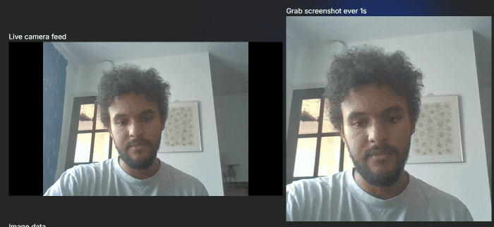
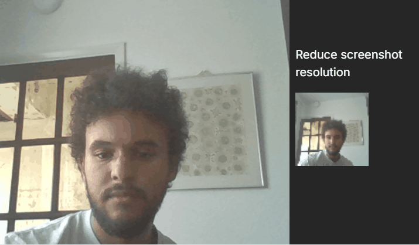
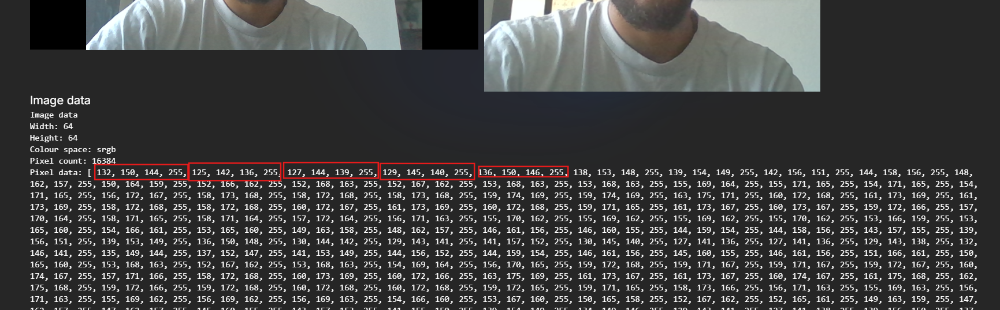
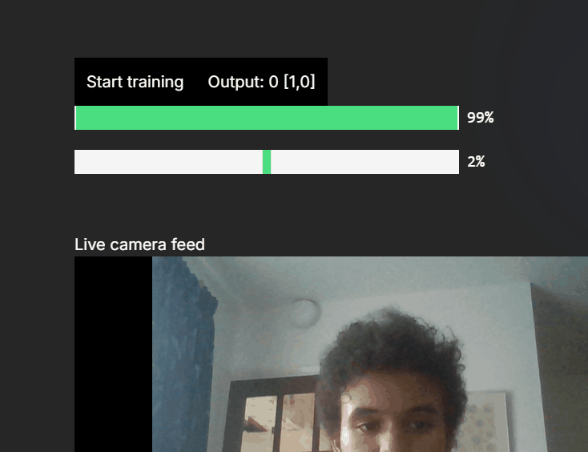

# README

## Demonstrations

### Getting a camera feed from a webcam

The first step was getting a live feed from the webcam. Fortunately this can be done easily using the standard browser APIs. You can see the live feed from the web came in the left panel below.

Then I had to configure the program to grab a frame from the webcam feed every N milliseconds. You see these frames being grabbed once a second in the right panel. The idea is that we'll extract the pixel data from these frames and use that to train our neural network.

### Reducing the quality

Similar to my handwriting recogniser project, the idea is that this program will be able to run in the browser with no prior training, and have the user train it themselves.

For this to be feasible, we want to reduce the complexity as much as possible, so that the network does not take forever to train.

I've reduce the quality down to 64 by 64, which seems to be enough to tell two people apart, but much more managable for a neural network that we want to run in the browser.

### Extracting image data from the image

Now that we can have a frame from our webcame feed, and have reduced the quality to a suitable range, we can extract the pixel data from it. The pixel data produced is in srgb format, where red, green, blue, and white point values are represented by numbers ranging from 0 to 255. In other words, every pixel has four numbers associated with it, each ranging from 0 to 255.

This means that even after reducing the image size to 64 x 64, were are still going to need 16,384 neurons in our input layer --- one for each of the data values in each of the pixels (numPixels is 64 x 64, and number of data values in each pixel is 4 i.e. red, green, blue, whitepoint.).

The handwriting recogniser only used 36 neurons in its input layer. So this is clearly a much bigger neural network, and will require more training.

Fortunately, as the network is trained on frames from a live webcame feed, which likely produces around 30fps natively, we can train our model a lot faster than we can could with the handwriting recogniser.

### Early test with neural network

- Had to move neural network into a webworker to avoid rendering issues on page.
- Reducing image resolution down to 40x40 also helped
- Possible to train images with drastically different features e.g. covering camera with hand vs sat in front of camera

